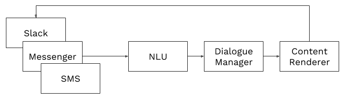

# 高阶组件

> 快速浏览 Botpress 机器人的不同组件

Botpress 一开始可能很吓人，但是一旦你了解了它的工作原理和原因，它实际上很简单。 让我们来分析一下 Botpress 机器人的所有主要组件。

✨ 提醒：如果你已经很了解机器人的构建，可以跳过本节。

## 模块

一个模块是 Botpress Core 本身之外的一个额外组件，你可以在你的机器人中安装这个组件以向 Botpress 添加新功能。 每个机器人都以某种方式使用模块，因为 Botpress 中几乎所有东西都是一个模块。 该架构为开发者提供了最大的灵活性和自由度。 有三种非正式的模块类别：**渠道** 、 **技能** 和 **功能** 。

## 渠道

渠道是一种允许你的机器人从特定聊天平台（如：Slack、Facebook Messenger、Telegram等）接收和发送消息的模块。

> 注意：与大多数机器人平台不同，渠道是在本地单独安装和配置的，这意味着你可以完全控制在你的机器人和聊天平台之间传输的数据。 Botpress 不会将消息代理到像 Microsoft Bot Framework 这样的第三方服务。

在服务层，Botpress 实现了一种排队机制，它可以顺序处理输入和输出消息。 如果由于某种原因未能处理或者发送消息，在重试之前则会向开发者和机器人管理员提出错误。

## NLU

Natural Language Understanding（或者简称 NLU）（自然语言理解）涉及你的机器人从聊天平台接收的纯粹的非结构化文本消息，并将它们转换成你的机器人能够使用的结构化数据。

NLU 完全是可选的，但是没有 NLU 的机器人必须依赖于过时的技术，例如：关键字检测，以便处理传入的消息并正确回复。

NLU 是 NLP（自然语言处理）的一个子集。 NLU 通常是涉及语言学与机器学习的非常复杂的主题。 幸运的是，有很多提供者允许我们抽象所有的复杂性，例如： [LUIS](https://luis.ai/)（Microsoft）、[DialogFlow](https://dialogflow.com/)（Google）、[IBM Watson](https://www.ibm.com/watson/services/natural-language-understanding/) 和 [RASA](https://github.com/RasaHQ/rasa_nlu)。

通过安装一个名字叫做 `botpress-nlu` 的模块，可以在 Botpress 中使用 NLU ，该模块为链接任何这些提供者提供功能。

## Dialogue Manager

从聊天平台接收文本并转换为结构化数据后，下一个涉及的组件是对话管理器（简称 DM ）。 DM 的角色是确定机器人应该做什么或者接下来说什么。

虽然在理论上，对话管理器能够实现一组 “if” 和 “else” 的语句，但是这种技术在实践中不能很好的扩展，因为自然对话的不可预测性会成倍增加这种状态机的复杂性。

Botpress 通过可扩展的 Visual Flow Editor 与强大的对话管理器相结合，解决了这个问题，该对话管理器抽象并消除了这些状态机背后的真实复杂性。

## 内容元素（和内容呈现器）

现在 DM 已经决定你的机器人应该回复一个特定的消息，在将消息发送给用户之前，需要几条信息：它应该发送什么样的消息以及消息将如何在不同的聊天平台上呈现？

这就是内容元素的用途。 内容元素可以看做是一个结构化对象，它保存关于该说些什么的信息，而内容呈现器则是将该结构化对象转换成特定平台的消息的函数。

内容呈现器的目的是允许开发人员指定相同信息应该在不同的聊天平台上的表现（即显示）。

## 总结

渠道是一种特殊的模块，它接收来自不同聊天平台的消息。 这些消息随后由 NLU 处理，以便将自然文本转换成机器人能理解的结构化数据。 对话管理器决定下来需要说出的内容，内容呈现器将其转换为特定于目标平台的消息。

