# 问答：流程

> 了解 Flow Engine 的工作原理以及如何实现可视化流程编辑器。

对于本节，你需要前往控制面板并单击 ”Flows“ 部分。 你应该可以看到带有一堆框和链接的流程图。

##  📚 状态、流程、节点、操作、转换

不要惊慌！ 既是这个观点期初看起来很混乱，但是一旦你了解了它的工作原理，其实很简单。 Flow Editor 的构建方式使得体验一致。

在我们真正开始使用流程控制管理之前，让我们先探索并理解流程控制管理的不同概念。

### Flows（流程）

你的机器人对话逻辑在流程中指定。 更复杂的机器人通常会分成多个较小的流程，而不是一个大流程。 将机器人分解成多个流的原因仅仅是为了增加维护性和可重用性。

**声明周期**

我们的流引擎是基于事件的，并且默认情况下是非阻塞的，这意味着流将执行它可执行的所有内容直到它需要等待。

> 注意：目前有两个原因能导致流 ”等待“ ：
> - 节点被标记为等待用户输入
> - 节点无法匹配转换到另一个节点的条件

几乎所有的逻辑都是在 **节点** （流程中的框）中定义和发生的。 我们说 ”几乎“ ，因为该规则有两个小例外：”On Receive（接收）“ 和 ”Transitions（转换）“ 事件。

**流程 ”接收“**

接收操作针对流中机器人接收到的每个新消息执行。

要定义新的接收操作，只需要导航到相关的流程，然后确保你没有选择任何节点。 左侧面板应该有一个名为 ”Flow Properties“ 的选项卡。在 ”On Receive“ 部分下，单击添加操作按钮以添加新的操作。

> 例子：接收流程
> - 审计追踪：记录特定流程范围内收到的消息的特定日志
> - 认证：运行一些认证操作
> - 情绪分析：确保对话的情绪保存健康

**流程“转换”**

转换与接收操作非常密切相关。操作本身只能运行操作（并修改状态），但不能将流程切换到其他节点。 这就是转换的作用。

转换有条件和目的地定义。 它们可以被视为全局性的对话挂钩，因为他们有能力将对话重新路由到一个全新的节点或流程。

流程转换将按顺序进行评估，匹配的第一个匹配项将被触发（其他项不会尝试）。 如果没有条件匹配，则没有任何反应，并且正常流程继续。

> 例子：流程转换
> - 认证：如果用户未通过身份验证，将用户重新路由到登录流程
> - 情绪分析：如果会话降级，将用户重新路由到人员后备节点
> - 匹配流程范围的意图，如 “取消” 等

**存储**

流程以json文件的形式存储在机器人的源文件中。 在本教程的上下文中，流程存储在 `src/flows/` 文件夹中。 每个流程被分成两个文件：逻辑文件（`*.flow.json`）和特定于视觉的文件（`*.ui.json`）。 拆分这些的原因是为了更容易维护和检查更改。

- `*.ui.json` 文件几乎总是可以从代码评论中忽略，因为它不会影响机器人的功能。
- `*.flow.json` 文件理论上是可以开发人员手动创建，而不是使用 GUI 。 技能就是这种情况，稍后我们将会介绍。

### Nodes（节点）

节点是你的机器人会话逻辑的主要单元。 一个活跃的对话（我们称之为会话）总是只有一个活动节点。 一个节点通常转换到另一个节点或者流程。 否则，谈话结束。然后来一用户的吓一跳消息将成为全新会话的一部分。

节点分为三个不同的阶段：**onEnter（A）** 、 **onReceive（B）** 和 **onNext（C）** 。

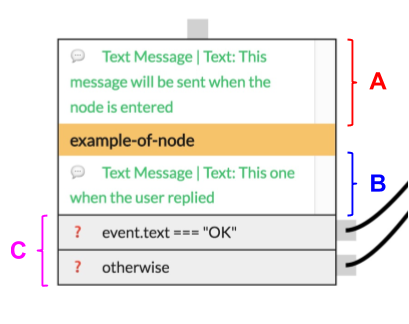

**onEnter**

onEnter 是进入节点时将执行的操作列表。 如果定义了多个动作，则所有这些动作都将按顺序执行。

**onReceive**

onReceive 是当节点作为活动节点接收消息是将执行的动作列表。 一旦定义了动作，节点将自动等待用户输入（橙色节点）。

当该属性未被使用时，该节点是非阻塞的（黑色）， 这意味着它将直接从 onEnter 流向 onNext。

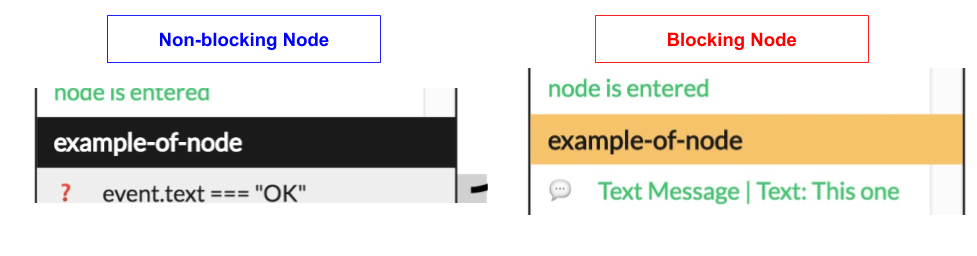

**onNext/Transitions**

onNext（也可以称为 Transitions ）与流程“转换”完全相同， 只是在 `onReceive` 或者 `onEnter` 执行后才计算条件。

> 特别案例： 如果没有定义条件，则默认行为是对话结束。 如果定义了条件但是没有匹配，则不会繁盛任何事情，即当前节点保持活动状态，并且在条件匹配时它将流动。 默认情况下，只有重新调用 `onReceive` 后才会重试 `onNext`。

节点可以流向：

- 同一流程内的另一个节点
- 本身（即循环回自己）
- 另一个流程
- 前一个流程（请查阅流程堆栈）
- 谈话结束

### State（状态）

每个对话都有一个与之相关的状态。 当会话开始时创建状态，并在会话结束的时候销毁。

在本教程的上下文中，这意味着在输入 “entry” 节点之前和执行 “over” 节点之后创建状态。

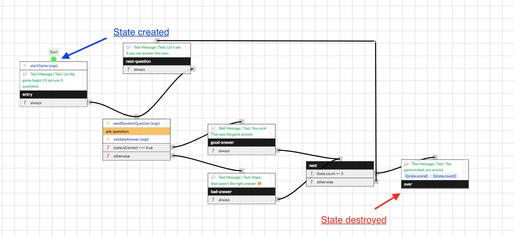

> 注意：状态对于会话是全局的，所以如果会话跨越多个流，那么状态对于所有流都是共享的。

###  🔨 亲自上手

现在你已经了解了流和节点是如何工作的，下面让我们进入问答机器人的一些用例。

**问5个问题而不是3个**

让我们从以下问答开始。 你应该识别成为 “next” 的黑色节点。

你会注意以下改变：

```
state.count >= 3
```

你可以从 UI 中简单地把3改为5，然后点击 “Save” 图标来保存更改。

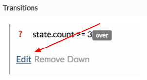

建议通过图形界面创建和编辑流。 它通常要简单的多、快得多，而且不易出错。

但是为了本教程的完整性，并且由于我们使技术人员并且喜欢代码（是吗？），让我们看看如何在代码中实现这一点。 打开 `src/flows/main.flow.json` 并且定位到 "next" 节点。 让我们更新以下代码：

```
{
  "id": "11219c5913",
  "name": "next",
  "next": [
    {
-    "condition": "state.count >= 3",
+    "condition": "state.count >= 5",
      "node": "over"
```

这是我们在本教程中第一次也是唯一一次按代码编辑流。

**排行榜：昵称**

好了，既然机器人能够提出合理的问题，我们想建立一个排行版，将游戏化推向另一个层次。

建立排行榜的第一步是在游戏结束时间询问用户他的昵称：

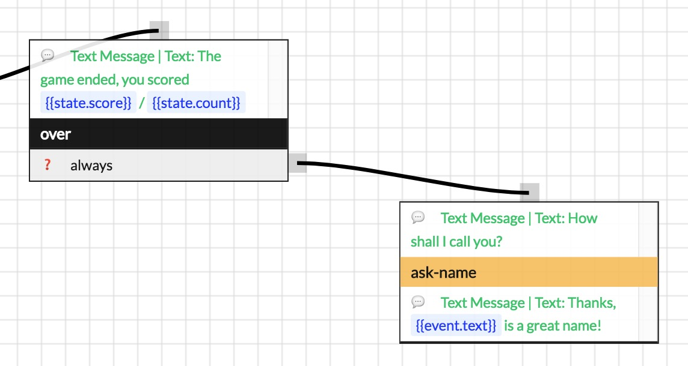

现在，在每一场游戏结束时，机器人都会想用户询问他或她的昵称。 但那不是我们想要的！ 实际上，我们只是想询问用户，如果我们不知道他们的昵称是什么的时候。

为了做到这一点，我们需要告诉机器人记住用户的昵称。 这个应该很简单，因为我们的问答模板附带了一个函数： `setUserTag({name, value})`。

**调用来自 Visual Flow Builder的操作**

我们想要的是：

- 当用户告诉机器人他们的昵称
- 那么我们说 “谢谢， ‘’ 是要给原始的昵称！”
- 那么我们想要将他们的昵称保存到用户范围的变量中。

要做到这一点，请点击 “ask-name” 节点，然后在 “onReceive” 部分，点击 Add 操作。

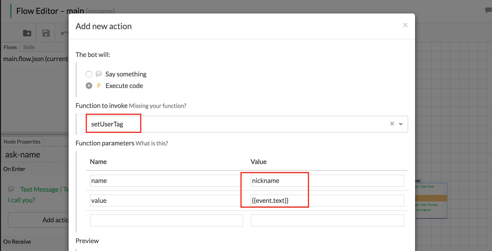

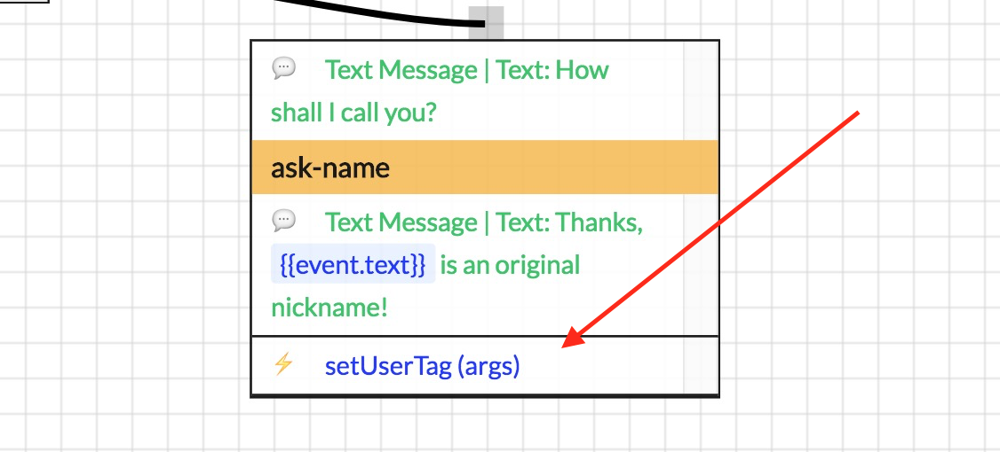

`setUserTag({name, value})` 操作的作用是将任何东西（值）保存到用户存储变量（标记为 `name`）中。

> 注意：不要担心 `setUserTag` 操作是如何实现的，我们将在下一节中介绍。

**回顾用户的昵称**

好了，既然我们坚持用户的昵称，我们还是需要在用户开始用细时取回该昵称。

为此，请单击 “entry” 节点，然后在 “onEnter” 部分，单击 Add 操作。

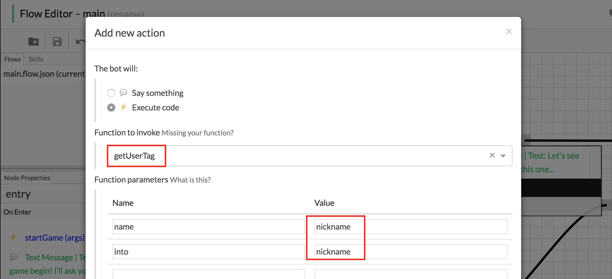

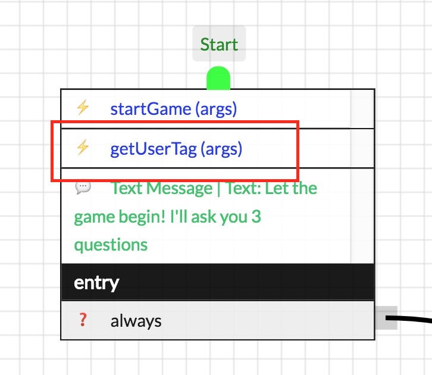

`getUserTag({name, into})` 操作的作用是将一个标签（叫做 `name`）加载到一个名为 `into` 的变量中。

**有条件的询问**

现在最后一步是只在我们不知道昵称是才要求昵称。 在这种情况下，`getUserTag` 应该将 `null` 置于 “nickname” 状态变量中。

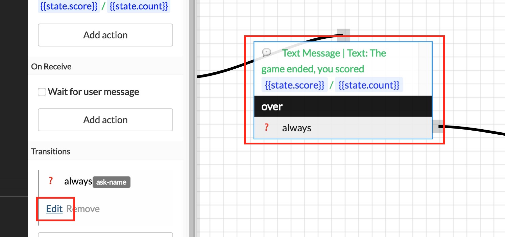

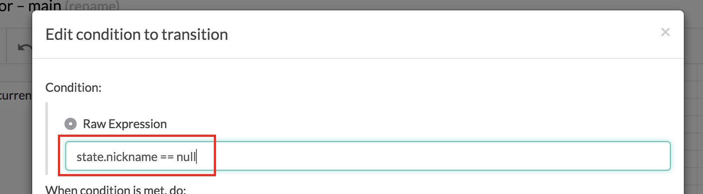

最后，我们已经知道昵称，则希望结束流程：

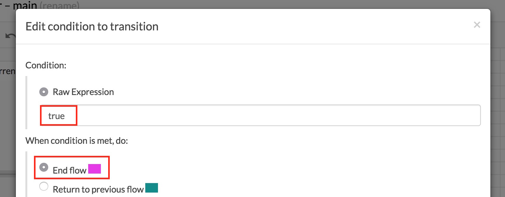

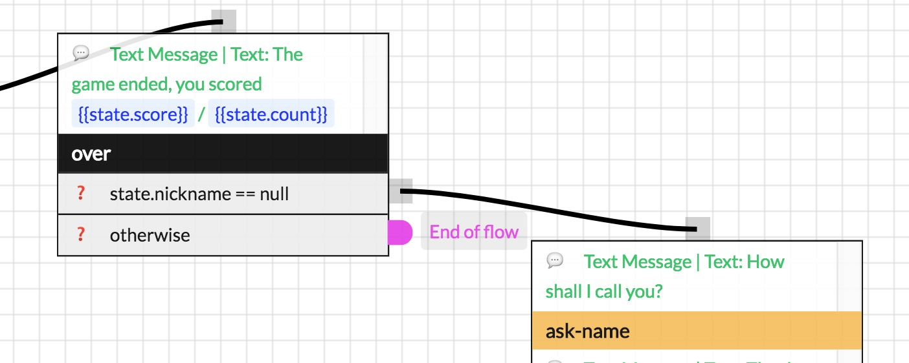

搞定！你的机器人现在要求用户输入一次昵称，然后永远记住它。

>  ✨ 提示：对机器人说 `/forget` ，让它忘记你的昵称。