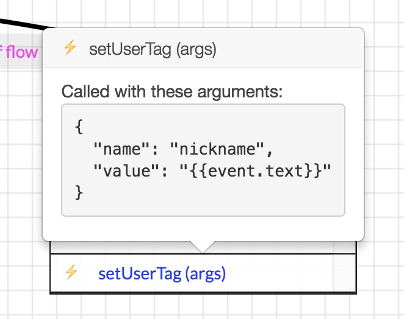

# 问答：操作

> 了解如何创建新的操作并在流程中调用它们。

## 操作怎么工作

操作本质上是机器人作为会话流程中的一部分执行的服务器端函数。 操作有权做许多事情：

- 改变谈话的状态
- 发送自定义消息到对话
- 执行任意代码，如调用 API 或将数据存储在数据库中。

由于它们只是常规的 JavaScript 函数，它们实际上可以做任何事情。

当对话管理器（DM）调用操作时，它将传递下列参数：

- `state` ：会话当前的状态。 这个对象被 `frozen`， 并且不能被突变。
- `event` ：通话中用户收到的原始（最新）事件。这个对象被 `frozen` ，不能被突变。
- `args` ：从 Visual Flow Builder 传递给此操作的参数。

操作本身必须返回一个新的状态对象。

## 如何定义新的操作

在我们的教程中，所有的操作都在 `src/actions.js` 文件中定义，并在 `src/index.js` 中注册，如下所示：

```
bp.dialogEngine.registerActions(actions)
```

`registerActions(map)` 以一个 map 对象为参数，其中的键是动作的名称，值是动作的函数。 你可以多次调用 `registerActions` ，如果你愿意，可以将你的操作分成多个文件。

## 操作的例子

我们来看看 `startGame` 。此操作非常简单：它将状态作为参数并返回标记新游戏开始的新状态。

```
startGame: state => {
  return {
    ...state, // we clone the existing state
    count: 0, // we then reset the number of questions asked to `0`
    score: 0  // and we reset the score to `0`
  }
},
```

现在让我们看看一个稍微复杂的操作。

`sendRandomQuestion` 操作执行以下操作：[[本节需要多解释，并且没有意义。 我将在详细阐述是重新审视]]

- 它使用内置的 `event.reply` 方法从 `trivia` 内容类型发送随机内容元素。
- 它捕获发送给用户的消息
- 它从多种选择中提炼出好的答案
- 它在状态中储存好答案

```
sendRandomQuestion: async (state, event) => {
  // The `-random()` extension picks a random element in all trivia Q's
  // We also retrieve the message we just sent
  // Notice that `event.reply` is asynchronous, so we need to `await` it
  const messageSent = await event.reply('#!trivia-random()')

  // We find the good answer
  const goodAnswer = _.find(messageSent.context.choices, { payload: 'TRIVIA_GOOD' })

  return {
    ...state, // We clone the state
    isCorrect: null, // We reset `isCorrect` (optional)
    count: state.count + 1, // We increase the number of questions we asked so far
    goodAnswer // We store the goodAnswer in the state
  }
},
```

最后，让我们看一下 `setUserTag` 动作，它使用从流中传递给函数的自定义参数。

```
/**
 * Sets user Tag.
 * @param {string} args.name - Name of the tag.
 * @param {string} args.value - Value of the tag.
 */
setUserTag: async (state, event, { name, value }) => {
  await event.bp.users.tag(event.user.id, name, value)
  return { ...state }
},
```

> 注意： `name` 和 `value` 来自 Flow Builder。 `name` 是一个静态值，而 `value` 是一个将在执行时评估的表达式。 在这种情况下，`event.text` 是用户所说的（即他的昵称）。



## 改变状态

你必须返回一个新的状态对象，因为它被冻结，所以无法修改原始状态对象。 要返回一个新的状态对象，只需要使用 `Object.assign()` 或者 ES6扩展运算符 克隆原始状态即可。

**例子：**

```
// Adding properties using the spread operator
return { ...state, nickname: 'Jackob' }

// Removing properties using the spread operator
const clone = { ...state }
delete clone.nickname
return clone
```

**不变的操作**

如果你的行为不修改状态，不返回任何内容（`return`）。 你可以返回原始装填的克隆： `return {...state}`。